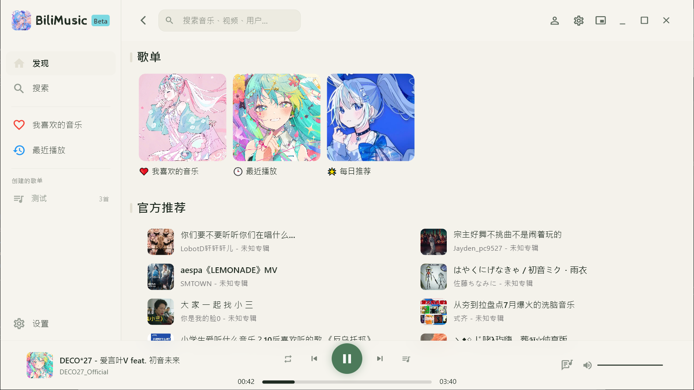
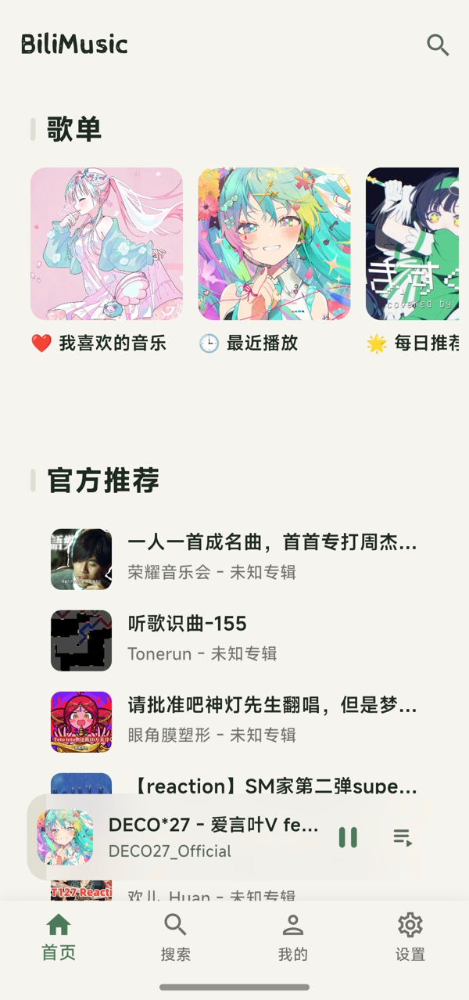
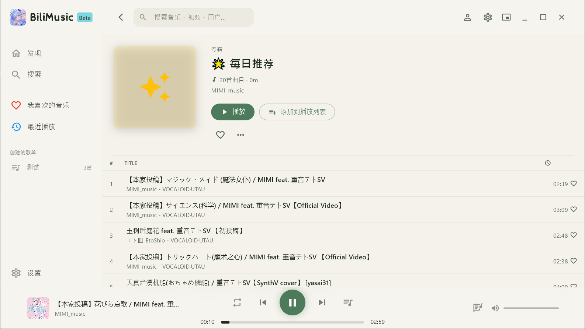
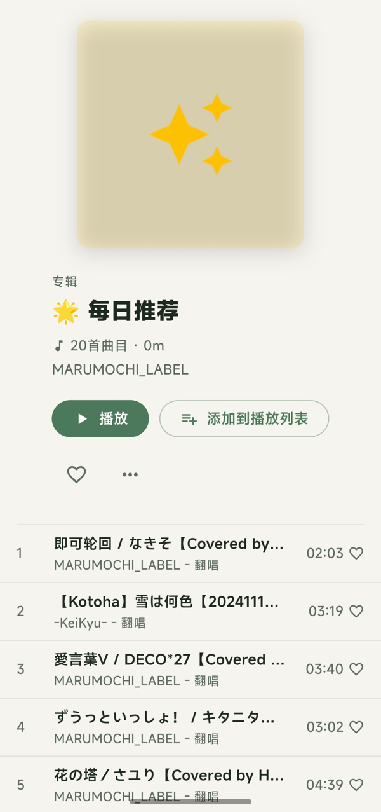

<div align="center">
  

  # BiliMusic
  <p><strong>把哔哩哔哩里的声音，整理成一张属于你的播放桌面。</strong></p>
  <p>基于 Flutter 的 B 站音乐播放器 · 跨平台 · GUI/TUI/Vela · 漫游发现 · 局域网同步</p>
  
  <p>
    <a href="https://github.com/NaivG/bilimusic/releases"></a>
    <a href="https://github.com/NaivG/bilimusic/stargazers"></a>
    <a href="https://github.com/NaivG/bilimusic/network/members"></a>
    <a href="https://github.com/NaivG/bilimusic/issues"></a>
    <a href="LICENSE"></a>
    <a href="https://flutter.dev/"></a>
    <a href="https://riverpod.dev/"></a>
    <a href="https://github.com/RichardLitt/standard-readme"></a>
  </p>
</div>


BiliMusic 是一款围绕 B 站音频内容打造的跨平台音乐播放器。基于 Flutter 一次覆盖 Windows、Linux、Android，对 macOS、Web 提供实验性支持，同时支持 Xiaomi Vela 端。它不复制视频平台，只做播放器该做的事：搜索、整理、连续播放与跨设备同步。

<div align="center">
  <sub>如果这个项目对你有帮助，欢迎 ⭐ Star 支持一下！</sub>
</div>

---

## 目录

- [安全](#安全)
- [背景](#背景)
- [平台支持](#平台支持)
- [安装](#安装)
  - [直接安装](#直接安装)
  - [从源码运行](#从源码运行)
  - [构建发布版本](#构建发布版本)
  - [终端客户端（TUI）](#终端客户端tui)
  - [小米 Vela 手表端](#小米-vela-手表端)
- [用法](#用法)
  - [常用入口](#常用入口)
  - [漫游模式](#漫游模式)
  - [设备同步](#设备同步)
- [核心特性](#核心特性)
- [界面预览](#界面预览)
- [登录与数据](#登录与数据)
- [更新与版本](#更新与版本)
- [技术架构](#技术架构)
- [代码导航](#代码导航)
- [主要依赖](#主要依赖)
- [开发命令](#开发命令)
- [维护者](#维护者)
- [致谢](#致谢)
- [如何贡献](#如何贡献)
- [许可证](#许可证)
- [Star History](#star-history)

---

## 安全

> [!IMPORTANT]
> BiliMusic 仅供学习交流使用，不得用于**任何**商业用途。项目只提供音频播放能力，不提供任何视听内容；音乐及视频内容的版权归原作者所有，请尊重版权并合理使用。
>
> 由于不可抗拒力，请勿在其他平台宣传或讨论本项目。

---

## 背景

主流 B 站客户端是完整的视频平台，对「只想听声音」的场景并不友好：后台播放受限、歌单能力弱、跨设备体验割裂。BiliMusic 把 B 站视为音乐内容源，专注于播放器的本职——搜索、整理、播放、漫游、同步。

技术选型上，Flutter 提供一套代码覆盖桌面与移动端；Riverpod 承担状态管理与依赖注入；just_audio 与 libmpv 负责音频解码；局域网同步通过 mDNS 与 TCP 配对实现。代码按 UI / 状态 / 编排 / 领域模型 / 基础设施分层，核心网络与存储层保持纯 Dart，以便 TUI 复用。

> 作者本人也是重度听歌爱好者，软件的开发会注重使用体验，在上线新功能时会反复打磨<s>（其实是听了半天）</s>，这一块不用担心。

---

## 平台支持

> [!IMPORTANT]
> 从 v2.0 开始，BiliMusic 将迁移至 AGP 9.0，这会升级 Android-SDK 版本至 Android 14，请自行留意兼容性。

| 平台 | 状态 | 备注 |
| --- | --- | --- |
| **Windows** 10+ | ✅ 稳定 | 解压即用，`x64`架构 |
| **Linux** | ✅ 稳定 | Ubuntu 20.04+ 或主流发行版，`x64`或`arm64`架构；需要 `libmpv-dev` |
| **Android** 12+ | ✅ 稳定 | 按设备架构选择 APK（`arm64-v8a` / `armeabi-v7a` / `x86_64`），或全平台 AAB |
| **macOS 10.15+, with Metal Support** | ⚠️ 实验性 | CI 产出 ad-hoc 签名的未公证 `.app`，也可从源码构建 |
| **iOS 13+** | ❓ 未经测试 | 可从源码构建无签名版本 |
| **Web** | ⚠️ 实验性 | 解压后部署到 Web 服务器，需配置 CORS |
| **Xiaomi Vela** | ✅ 稳定 | 适用于小米、红米手表系列（API 2+），下载安装`.rpk`，详见[小米 Vela 手表端](#小米-vela-手表端) |

关于应用内更新：Android / Windows / Linux 支持；Web 与 macOS 跳转 Releases（见[更新与版本](#更新与版本)）。

---

## 安装

### 直接安装

前往 [Releases](https://github.com/NaivG/bilimusic/releases) 下载对应平台的最新版本，解压运行即可。

- Android / Windows / Linux：启动时自动检查更新。
- macOS / Web：需手动重新下载。

```bash
# Linux 因为打包时不含libmpv，需要先安装依赖
sudo apt install libmpv-dev
```

### 从源码运行

环境要求：Flutter 3.x · Dart SDK ^3.13.0

```bash
git clone https://github.com/NaivG/bilimusic.git
cd bilimusic
flutter pub get
flutter run               # 默认设备
flutter run -d <device-id> # 指定设备
```

### 构建发布版本

```bash
flutter build windows
flutter build linux
flutter build apk
flutter build macos
flutter build ios

# Web 需先生成 sqlite 资源
flutter pub run sqflite_common_ffi_web:setup --force
flutter build web
```

> Web 端 sqlite 资源（`web/sqlite3.wasm`、`web/sqflite_sw.js`）不入库，必须由 `setup` 命令生成，否则构建产物无法初始化本地数据库。

### 终端客户端（TUI）

仓库附带一个实验性终端客户端，与 App 共享登录状态（当前基于 Windows 下的 libmpv）：

```bash
dart run bin/bilimusic_tui.dart            # 交互式 TUI
dart run bin/bilimusic_tui.dart --probe    # 网络与解码分层自检
dart run bin/bilimusic_tui.dart --smoke    # 无终端驱动完整循环
dart run bin/bilimusic_tui.dart --preview  # 静态设计预览（假数据，无网络无声）
```

#### 小米 Vela 手表端

`vela/` 是与 Flutter 主项目并列的小米 Vela JS 快应用形态手表客户端，与主项目**不共享代码、不共享包管理**。该手表端走 `npm`，不跑 `flutter pub`：

```bash
cd vela
npm install                       # 首次安装依赖（仅需一次）
npm run verify                    # 离线自检（纯 Node，无设备/模拟器）
npm run start                     # AIoT-IDE 调试启动（aiot server --watch）
npm run build                     # 构建 RPK（aiot build）
```

> 详细设计目标、适配机型表、安装教程、目录结构等，请阅读 [`vela/README.md`](vela/README.md)。

---

## 用法

典型路径：

```text
搜索内容 → 加入歌单 → 开始播放 → 匹配歌词与主题 → 漫游扩展 → 局域网同步
```

### 常用入口

| 入口 | 用途 |
| --- | --- |
| 首页 | 推荐、猜你喜欢、播放历史 |
| 搜索 | 通过关键词 / BV / AV 查找 B 站音乐内容 |
| 歌单 | 管理本地歌单与导入的收藏夹 |
| 个人中心 | 用户信息、收藏、历史、漫游、设备同步 |
| 设置 | 主题、外观、播放、缓存等偏好 |

### 漫游模式

1. 在个人中心进入漫游模式。
2. 选择歌单或歌曲作为种子。
3. 选择「相似 / 平衡 / 探索」风格。
4. 队列接近末尾时自动发现并补充相关歌曲。

### 设备同步

同局域网内开启设备同步：应用通过 mDNS 发现设备，通过二维码或配对请求建立信任连接，之后可同步播放状态、队列与远程控制。

---

## 核心特性

**发现与推荐**
- 支持 `BV` 号、`AV` 号与关键词搜索。
- 首页推荐、猜你喜欢、播放历史。
- 基于 simhash 的相关度排序与漫游补队列。
- 三种漫游风格：**相似 / 平衡 / 探索**。

**播放体验**
- 播放 / 暂停 / 上一首 / 下一首 / 进度跳转；定时关闭。
- 多 P 视频切换、顺序 / 随机 / 单曲循环。
- A/B 双播放器 + equal-power 曲线的交叉淡入淡出。
- 多档音质选择，DASH 音频流按选择取流并回显实际生效音质。
- 后台播放、系统媒体通知、音量持久化。
- 动态歌词：自动匹配、逐字点亮、辉光效果。
- 主题系统：Lucent / Nocturne / Verdant / Gruvbox / Nord / Solarized 六套主题，运行时切换并按封面主色适配。
- 离线缓存：歌曲可下载到本地，断网也能继续播放。

**整理与同步**
- 本地歌单：创建、编辑、删除、拖拽排序、滑动删除。
- B 站收藏夹导入并跟踪同步状态。
- mDNS 局域网发现 + TCP 二维码配对 + 远程播放控制。
- 支持手表、折叠屏外屏与近方形 PiP 窗口布局。

**终端客户端（TUI）**
- 主页与搜索结果两页布局，支持关键词 / `BV` / `AV` 搜索、播放、暂停与切歌，键盘与鼠标可用。
- FFI 直驱 libmpv（复用 media_kit 的 Windows 库产物），与 App 共享登录态与网络层。
- 附带 `--probe` / `--smoke` / `--preview` 自检、驱动与预览模式。

---

## 界面预览

> 默认使用 Verdant 主题展示。

<div align="center">
  
  
  <p><sub>首页 · 推荐与播放历史</sub></p>

  
  
  <p><sub>播放页 · 封面、歌词与播放控制</sub></p>

  
  
  <p><sub>歌单 · 本地歌单与 B 站收藏夹</sub></p>
</div>

---

## 登录与数据

部分 B 站功能需要登录：

- **移动端**：通过 [gt3_flutter_plugin](https://pub.dev/packages/gt3_flutter_plugin) 完成账号密码登录。
- **桌面端**：使用 B 站 App 扫码登录。
- **数据迁移**：可在数据管理中将移动端数据迁移到桌面端。

> **数据存储**：歌单、收藏和历史保存在本地 SQLite；设置使用 `shared_preferences`；网络资源与歌词进入本地缓存；歌曲可另存为离线缓存，断网可播。迁移或清理前请做好备份。

---

## 更新与版本

应用启动后自动检查一次新版本，发现更新时弹出更新日志与「立即更新」按钮。检查与下载是两套独立操作：

| 环节 | 来源 | 说明 |
| --- | --- | --- |
| 检测 | 仓库 `assets/version.json` | 只比较 `major.minor.patch`，忽略 `+build` 号 |
| 更新日志 | `assets/version.json` 的 `changelog` | 应用内「设置 → 更新日志」读取随包内置的同一份数据 |
| 下载 | GitHub Releases API | 点击更新时实时取下载地址与 sha256 摘要 |

各平台行为：

- **Android**：经 `flutter_app_update` 下载 APK 并拉起系统安装页；Android 13+ 会先申请通知权限以展示下载进度。
- **Windows / Linux**：下载便携版 zip，校验 sha256 后原地替换文件并重启。
- **Web / macOS**：不支持应用内更新，点击后跳转 Releases 页面手动下载。

---

## 技术架构

### 一次播放请求的路径

```text
UI / Riverpod Provider
        ↓
PlayerCoordinator  ←── RoamingService
        ↓
DualAudioService  ←── NotificationService / PiP / LAN Sync
        ↓
ApiService
        ↓
BiliClient  ←── Bilibili API
```

### 分层职责

| 层 | 目录 | 职责 |
| --- | --- | --- |
| UI | `features/*/ui/` · `widgets/` · `app/shells/` | 页面、组件、横竖屏与方屏布局 |
| 状态 | `features/*/*_providers.dart` · `app/shells/` | Riverpod 状态、命令与页面导航 |
| 编排 | `features/*/logic/` · `services/` | 播放编排、漫游、局域网同步、登录等业务流程 |
| 领域模型 | `domain/` | 纯共享数据模型 |
| 基础设施 | `core/` | HTTP 客户端、异常体系、SQLite 与缓存 |
| 视觉系统 | `shared/theme/` | Palette、Token、主题注册切换 |
| 组合根 | `app/app_providers.dart` | 长生命周期服务的创建与释放 |

> 长生命周期服务统一在 `lib/app/app_providers.dart` 中创建与释放；UI 只消费 Provider，不直接实例化业务管理器。

---

## 代码导航

```text
lib/
├── main.dart                  # 应用入口：窗口、数据库、audio_service 初始化
├── app/                       # app_providers.dart 组合根 + shells/ 应用外壳与导航
├── core/                      # 无 UI 基础设施
│   ├── network/               # BiliClient、ApiService、PassportClient 与异常体系
│   └── storage/               # AppDatabase(SQLite) 与 CacheManager
├── domain/                    # 纯共享模型：Music、Playlist、BiliItem、PeerDevice 等
├── features/                  # 功能模块，内部按 logic/ models/ ui/ 分层
│   ├── player/                # PlayerCoordinator、DualAudioService、通知、PiP、正在播放页
│   ├── lyrics/                # 歌词检索、多源匹配与逐字渲染
│   ├── playlist/              # 歌单 / 收藏 / 历史的单一数据源
│   ├── roam/                  # 漫游模式：simhash 排序、种子多样性与风格策略
│   ├── lan_sync/              # 局域网同步：mDNS 发现、二维码配对、远程控制
│   ├── offline/               # 离线缓存：下载管理、断网播放与缓存清理
│   ├── auth/                  # 扫码登录、验证码与 Cookie 管理
│   ├── fav_sync/              # B 站收藏夹导入与同步状态跟踪
│   ├── home/ search/ profile/ # 首页推荐、搜索、个人中心
│   └── settings/ update/      # 设置、数据迁移；更新检查、Release 解析、应用内更新与更新日志
└── shared/                    # 跨模块共享：widgets/、theme/(Lucent/Nocturne/Verdant/Gruvbox/Nord/Solarized)、utils/

bin/
├── bilimusic_tui.dart         # 终端客户端入口（dart_tui + libmpv FFI）
└── tui/                       # TUI 内部实现：mpv_player(FFI)、tui_api、app_model、probe
```

---

## 主要依赖

| 依赖 | 用途 |
| --- | --- |
| [Flutter](https://flutter.dev/) | 跨平台 UI 框架 |
| [Riverpod](https://riverpod.dev/) | 状态管理与依赖注入 |
| [just_audio](https://pub.dev/packages/just_audio) · [audio_service](https://pub.dev/packages/audio_service) | 音频播放 + 后台与系统媒体控制 |
| [just_audio_media_kit](https://pub.dev/packages/just_audio_media_kit) | 桌面端 libmpv 音频后端 |
| [media_kit_libs_audio](https://pub.dev/packages/media_kit_libs_audio) | 桌面端 libmpv 原生库（TUI 亦复用其 libmpv 产物） |
| [http](https://pub.dev/packages/http) | 统一 HTTP 客户端 |
| [bonsoir](https://pub.dev/packages/bonsoir) | mDNS 局域网设备发现 |
| [sqflite](https://pub.dev/packages/sqflite)（含 ffi / ffi_web 实现） | 本地 SQLite 数据存储 |
| [flutter_lyric](https://pub.dev/packages/flutter_lyric) · [lyrics_now](https://github.com/NaivG/lyrics_now) | 歌词渲染与歌词源检索 |
| [color_thief_dart](https://pub.dev/packages/color_thief_dart) | 封面主色提取 |
| [gt3_flutter_plugin](https://pub.dev/packages/gt3_flutter_plugin) | 登录极验验证码 |
| [window_manager](https://pub.dev/packages/window_manager) | 桌面窗口管理 |
| [flutter_app_update](https://pub.dev/packages/flutter_app_update) · [permission_handler](https://pub.dev/packages/permission_handler) | Android 应用内更新与通知权限检查 |
| [flutter_cache_manager](https://pub.dev/packages/flutter_cache_manager) | 缓存管理 |
| [shared_preferences](https://pub.dev/packages/shared_preferences) | 跨平台本地存储 |
| [dart_tui](https://pub.dev/packages/dart_tui) | 终端 UI 框架 |

---

## 开发命令

```bash
flutter pub get       # 安装依赖
flutter analyze       # 静态分析（CI 使用 dart analyze --no-fatal-warnings）
dart format .         # 提交前必须执行，避免 CI 产生格式化噪声提交
flutter test          # 运行测试
flutter run           # 调试运行
```

> 提交改动前建议至少执行 `flutter analyze` 与 `dart format .`，并在目标平台完成一次构建验证。

---

## 维护者

<a href="https://github.com/NaivG/bilimusic/graphs/contributors">
  
</a>

---

## 致谢

- UI 设计灵感：Apple Music, 某云音乐, [ParticleMusic](https://github.com/AfalpHy/ParticleMusic)
- 歌词获取：[lyrics_now](https://github.com/NaivG/lyrics_now)
- 歌词渲染：[coriander_player](https://github.com/Ferry-200/coriander_player), [flutter_lyric](https://pub.dev/packages/flutter_lyric)
- GitHub Actions：[FlutterHub](https://github.com/xmaihh/FlutterHub)
- README 规范：[standard-readme](https://github.com/RichardLitt/standard-readme)

---

## 如何贡献

欢迎通过 [Issue](https://github.com/NaivG/bilimusic/issues) 报告问题，或提交 Pull Request 改进功能。提交前请尽量：

1. 说明复现环境、平台与具体步骤。
2. 保持改动聚焦，并遵循现有 Flutter / Dart 代码风格。
3. 执行 `flutter analyze` 和相关测试。
4. 不提交 Cookie、账号信息、构建产物或其他敏感数据。

---

## 许可证

本项目采用 [GNU Affero General Public License v3.0](LICENSE) 许可证。

```text
Copyright (C) 2026 NaivG and contributors.

This program is free software: you can redistribute it and/or modify
it under the terms of the GNU Affero General Public License as published by
the Free Software Foundation, either version 3 of the License, or
(at your option) any later version.

This program is distributed in the hope that it will be useful,
but WITHOUT ANY WARRANTY; without even the implied warranty of
MERCHANTABILITY or FITNESS FOR A PARTICULAR PURPOSE.
```

> [!WARNING]
> 本项目的图标采用 [CC BY-NC 4.0](https://creativecommons.org/licenses/by-nc/4.0/) 协议。

---

## Star History

[](https://star-history.com/#NaivG/bilimusic&Date)